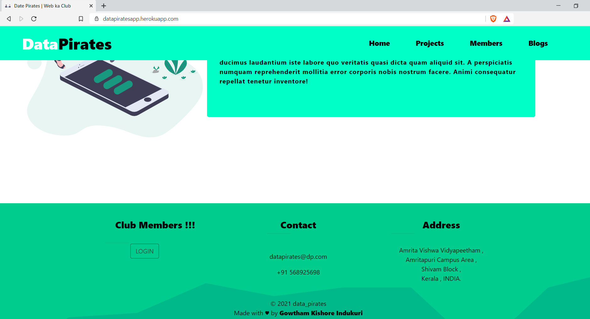
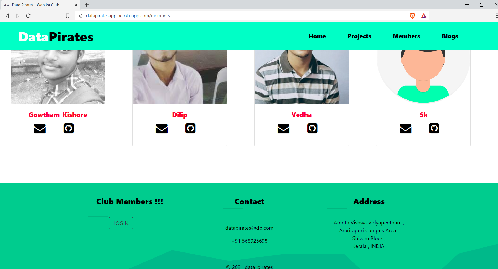
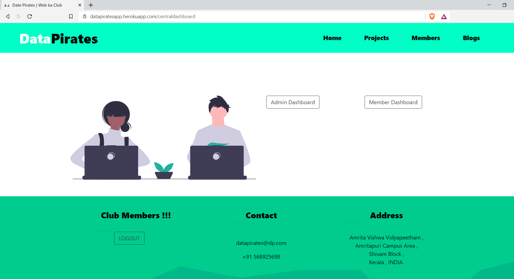
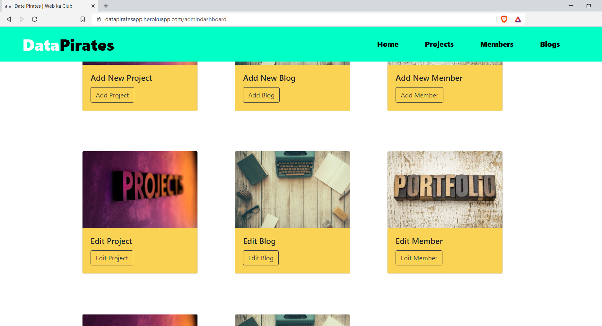
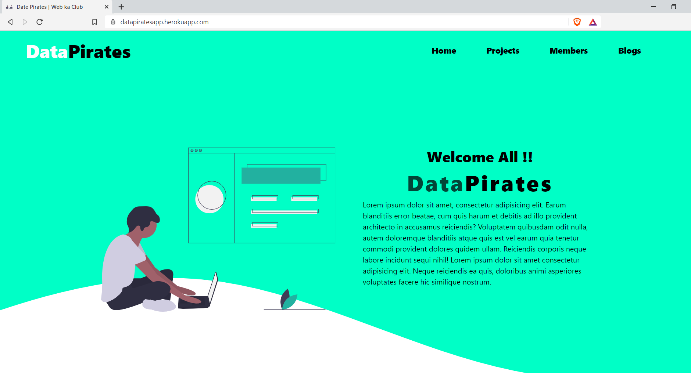

# Labsite

    

## Contents
1. ABOUT 
2. TECH SLACK
3. GALLERY
4. FUTURE WORK
5. CONTRIBUTIONS
6. WEBSITE 
7. LICENSE

## About
- Preparing for exam or any practical exams need a perfect book , but books can't help us to revice the topics .
- So here comes a solution which is a **Notes** .
- But this notes can be shared to our friends and near persons, but what if theres is a site that can store notes and help the future juniors to prepare for there exams.
- That is the motivation for  **Note's App** a notes sharing app.

## Tech Slack
- [HTML](https://html.com/)
- [CSS](https://www.free-css.com/)
- [Javascript](https://www.javascript.com/)
- [BootStrap](https://getbootstrap.com/)
- [Nodejs](https://nodejs.org/en/)
- [Expressjs](https://expressjs.com/)
- [MongoDB](https://www.mongodb.com/)
- [ejs](https://ejs.co/)

## Gallery

    

    

    

    

    

## Future work
- **Search bar** has to be implemented for effective searching of notes.
- **Admin dashboard** has to be created for data monitering and spam detection.
- **Recommendation** system has to be implemented for explore notes section.
- **UI** can be developed for good user experience and iteraction

## Contributions
- All contributions and suggestions are welcome .
- Start with issues and for more features write to <a href ="mailto:gowthamkishoreindukuri@gmail.com">gowthamkishoreindukuri@gmail.com</a>

## Website

- <a href="https://notesapppp.herokuapp.com/">Notes App</a>

## Licence
- ***GNU GENERAL PUBLIC LICENSE***

